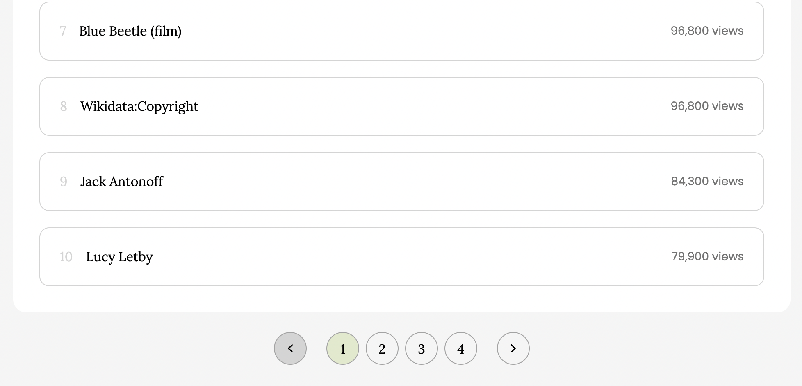
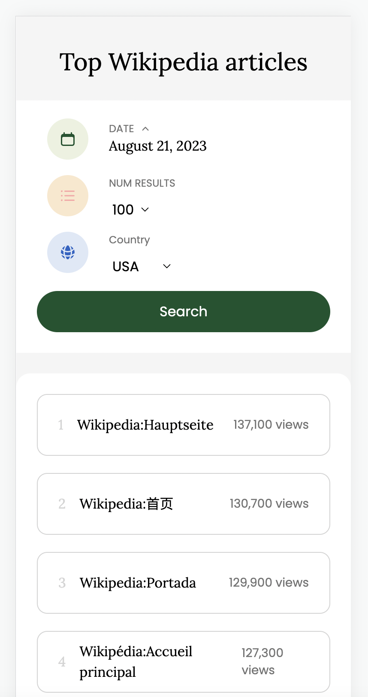

# Wikipedia React!

This repo contains the code to create a Wikipedia app to display the most viewed pages for a specific day and country based on user inputs.

This application is using React and TypeScript working in Vite with HMR and some ESLint rules.

## Table of Contents

- [Wikipedia React!](#wikipedia-react)
  - [Table of Contents](#table-of-contents)
  - [Quick Install Setup](#quick-install-setup)
  - [Setup For Mac and Linux Users (Unix Users)](#setup-for-mac-and-linux-users-unix-users)
  - [Clone and Install](#clone-and-install)
  - [Running the code](#running-the-code)
  - [Runnig the test suite](#runnig-the-test-suite)
  - [Testing the app](#testing-the-app)
  - [API endpoints](#api-endpoints)
  - [Images of the App](#images-of-the-app)

## Quick Install Setup

Already have Node/NPM installed? Then start here. Otherwise we have some instructions below in this document if you don't.

**Clone the repository**

- Do `git clone https://github.com/opagani/wikipedia-react.git` first
- Do `cd wikipedia-react`

**Installation**

- Do `npm install` first
- Do `npm run dev`
- It should be running now on localhost:5173

If the app runs, you're ready for testing the app

## Setup For Mac and Linux Users (Unix Users)

If you have any problems with these steps, see the **Troubleshooting** section at the bottom of this page.

- **Need to install Git?** - http://git-scm.com/downloads
- **Need to install Node?** We recommend using [NVM (Node Version Manager)](https://github.com/nvm-sh/nvm)

Note that **NPM (Node Package Manager)** is a command-line tool that will also be installed with Node

If you need to verify that you have NVM installed, do: `nvm version`. Then install Node. Which version of Node should I use? It probably won't matter much, but we try to use the [Active Version](https://nodejs.org/en/about/releases/).

```sh
# For Node 18 (for example)
$ nvm install 18

# See this page for more install options:
# https://github.com/nvm-sh/nvm#usage
```

Verify you have Git, Node, and npm installed. Installing Node will install NPM:

```sh
$ git --version
$ node --version
$ npm --version
```

Now jump to **Clone and Install** below

<hr />

## Clone and Install

- Do `git clone https://github.com/opagani/wikipedia-react.git` first
- Do `cd wikipedia-react`
- Do `npm install`

## Running the code

If you have any issues running the code, we have a general **Troubleshooting** section at the bottom of this page.

```sh
# If you're in the root path of the repo

# Run the app
$ npm run dev

```

Go to `localhost:5173` in your browser. You have to do this manually.

If the application renders up in the browser, you're ready to go. 👍

## Runnig the test suite

```sh
# If you're in the root path of the repo

# Run the test
$ npm run test

```

```sh
oscarpagani@Oscars-MacBook-Pro wikipedia-react % npm run test

> wikipedia-react@0.0.0 test
> jest

ts-jest[config] (WARN) message TS151001: If you have issues related to imports, you should consider setting `esModuleInterop` to `true` in your TypeScript configuration file (usually `tsconfig.json`). See https://blogs.msdn.microsoft.com/typescript/2018/01/31/announcing-typescript-2-7/#easier-ecmascript-module-interoperability for more information.
 PASS  src/components/Article.test.tsx
  Article
    ✓ should display a rank of 1 (19 ms)
    ✓ should display article without any '_' in it (2 ms)
    ✓ should display views_ceil of 214,400 (1 ms)

Test Suites: 1 passed, 1 total
Tests:       3 passed, 3 total
Snapshots:   0 total
Time:        1.311 s, estimated 2 s
Ran all test suites.
```

## Testing the app

**Manual testing**

- A user should be able to select a time on a calendar (defaulting to yesterday)
- A user should be able to decide how many results to show (options being 25, 50, 75, 100, 200 default to 100)
- A user should be able to search by country (options being USA, Japan, Italy, China, France default to USA)
- Based on what is selected, a user will see a frontend view that includes the name of the article, the number of views and the rank.

## API endpoints

The wikipedia API allows you to get a list of articles with the most page views for a specific day and a specific country:

https://wikimedia.org/api/rest_v1/metrics/pageviews/top-per-country/US/all-access/2023/08/21

Response:

```
{
items: [
      {
         country: "US",
         access: "all-access",
         year: "2023",
         month: "08",
         day: "10",
         articles: [
            {
               article: "Sean_O'Malley_(fighter)",
               project: "en.wikipedia",
               views_ceil: 214400,
               rank: 1,
            },
            {
               article: "Ron_Cephas_Jones",
               project: "en.wikipedia",
               views_ceil: 167500,
               rank: 2,
            }
            ...
         ]
      }
   ]
}
```

## Images of the App

**Desktop view**




<hr />

**Responsive view**



